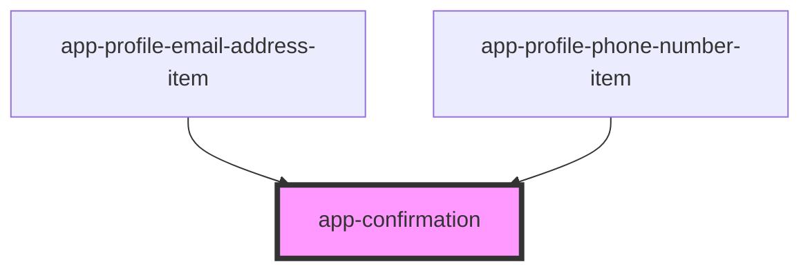

# app-confirmation

<!-- Auto Generated Below -->

## Properties

| Property              | Attribute               | Description | Type      | Default    |
| --------------------- | ----------------------- | ----------- | --------- | ---------- |
| `message`             | `message`               |             | `string`  | `''`       |
| `primaryActionText`   | `primary-action-text`   |             | `string`  | `'Delete'` |
| `secondaryActionText` | `secondary-action-text` |             | `string`  | `'Cancel'` |
| `visible`             | `visible`               |             | `boolean` | `false`    |

## Events

| Event                        | Description | Type               |
| ---------------------------- | ----------- | ------------------ |
| `primaryConfirmationClick`   |             | `CustomEvent<any>` |
| `secondaryConfirmationClick` |             | `CustomEvent<any>` |

## Dependencies

### Used by

 - [app-profile-email-address-item](../app-profile-email-address-item)
 - [app-profile-phone-number-item](../app-profile-phone-number-item)

### Graph

----------------------------------------------

*Built with [StencilJS](https://stenciljs.com/)*
