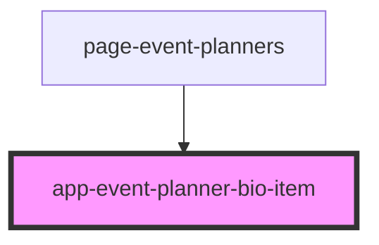

# app-event-planner-bio-item

<!-- Auto Generated Below -->

## Properties

| Property         | Attribute          | Description | Type     | Default     |
| ---------------- | ------------------ | ----------- | -------- | ----------- |
| `Bio`            | `bio`              |             | `string` | `undefined` |
| `CompanyName`    | `company-name`     |             | `string` | `undefined` |
| `EventPlannerId` | `event-planner-id` |             | `number` | `undefined` |
| `FirstName`      | `first-name`       |             | `string` | `undefined` |
| `LastName`       | `last-name`        |             | `string` | `undefined` |

## Events

| Event                      | Description | Type                  |
| -------------------------- | ----------- | --------------------- |
| `eventPlannerItemSelected` |             | `CustomEvent<number>` |

## Dependencies

### Used by

 - [page-event-planners](../pages/page-event-planners)

### Graph

----------------------------------------------

*Built with [StencilJS](https://stenciljs.com/)*
