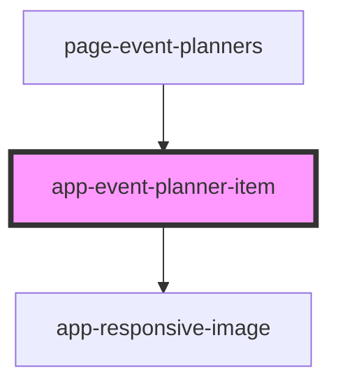

# app-event-planner-item

<!-- Auto Generated Below -->

## Properties

| Property  | Attribute | Description                    | Type                                        | Default     |
| --------- | --------- | ------------------------------ | ------------------------------------------- | ----------- |
| `planner` | --        | The details about the planner. | `DataResponse<GetFoundingPlannersResponse>` | `undefined` |

## Events

| Event                      | Description | Type                  |
| -------------------------- | ----------- | --------------------- |
| `eventPlannerItemSelected` |             | `CustomEvent<number>` |

## Dependencies

### Used by

 - [page-event-planners](../pages/page-event-planners)

### Depends on

- [app-responsive-image](../app-responsive-image)

### Graph

----------------------------------------------

*Built with [StencilJS](https://stenciljs.com/)*
