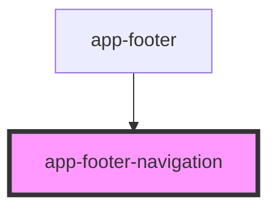

# app-footer-navigation

<!-- Auto Generated Below -->

## Properties

| Property    | Attribute | Description | Type         | Default |
| ----------- | --------- | ----------- | ------------ | ------- |
| `menuItems` | --        |             | `MenuLink[]` | `[]`    |

## Dependencies

### Used by

 - [app-footer](../app-footer)

### Graph

----------------------------------------------

*Built with [StencilJS](https://stenciljs.com/)*
