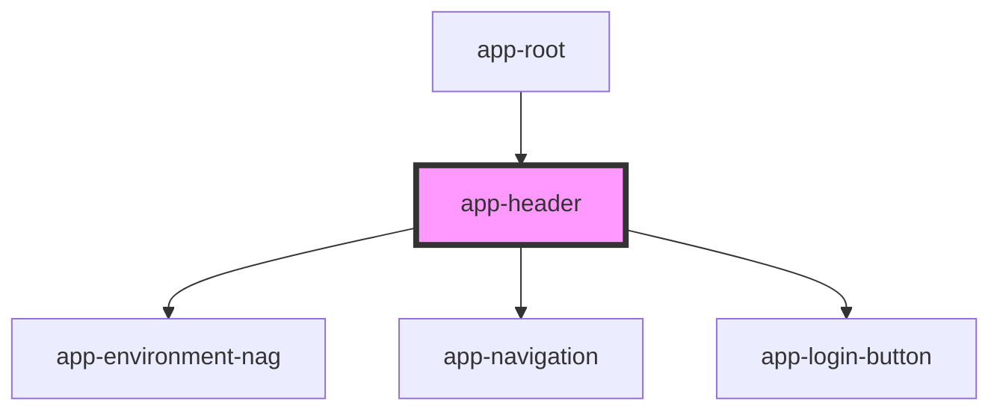

# app-header

<!-- Auto Generated Below -->

## Properties

| Property          | Attribute          | Description | Type     | Default     |
| ----------------- | ------------------ | ----------- | -------- | ----------- |
| `backgroundClass` | `background-class` |             | `string` | `undefined` |

## Dependencies

### Used by

 - [app-root](../app-root)

### Depends on

- [app-environment-nag](../app-environment-nag)
- [app-navigation](../app-navigation)
- [app-login-button](../app-login-button)

### Graph

----------------------------------------------

*Built with [StencilJS](https://stenciljs.com/)*
