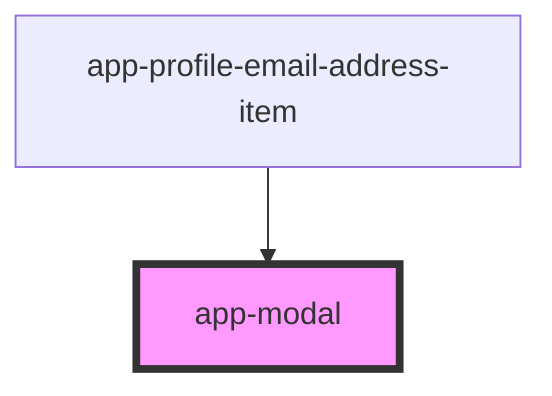

# app-modal

<!-- Auto Generated Below -->

## Properties

| Property              | Attribute               | Description | Type      | Default     |
| --------------------- | ----------------------- | ----------- | --------- | ----------- |
| `dialogTitle`         | `dialog-title`          |             | `string`  | `undefined` |
| `primaryActionText`   | `primary-action-text`   |             | `string`  | `'Save'`    |
| `secondaryActionText` | `secondary-action-text` |             | `string`  | `'Cancel'`  |
| `visible`             | `visible`               |             | `boolean` | `false`     |

## Events

| Event                 | Description | Type               |
| --------------------- | ----------- | ------------------ |
| `primaryModalClick`   |             | `CustomEvent<any>` |
| `secondaryModalClick` |             | `CustomEvent<any>` |

## Dependencies

### Used by

 - [app-profile-email-address-item](../app-profile-email-address-item)

### Graph

----------------------------------------------

*Built with [StencilJS](https://stenciljs.com/)*
