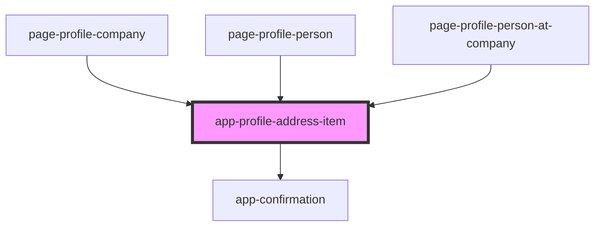

# app-profile-address-item

<!-- Auto Generated Below -->

## Properties

| Property                 | Attribute              | Description | Type                                         | Default     |
| ------------------------ | ---------------------- | ----------- | -------------------------------------------- | ----------- |
| `addressItem`            | --                     |             | `DataResponse<AddressAttributes>`            | `undefined` |
| `appliesTo` _(required)_ | `applies-to`           |             | `"company" \| "person" \| "personAtCompany"` | `undefined` |
| `canEdit`                | `can-edit`             |             | `boolean`                                    | `undefined` |
| `companyId`              | `company-id`           |             | `number`                                     | `undefined` |
| `personAtCompanyId`      | `person-at-company-id` |             | `number`                                     | `undefined` |
| `personId`               | `person-id`            |             | `number`                                     | `undefined` |

## Events

| Event            | Description | Type                  |
| ---------------- | ----------- | --------------------- |
| `addressDeleted` |             | `CustomEvent<number>` |

## Dependencies

### Used by

 - [page-profile-company](../pages/page-profile-company)
 - [page-profile-person](../pages/page-profile-person)
 - [page-profile-person-at-company](../pages/page-profile-person-at-company)

### Depends on

- [app-confirmation](../app-confirmation)

### Graph

----------------------------------------------

*Built with [StencilJS](https://stenciljs.com/)*
