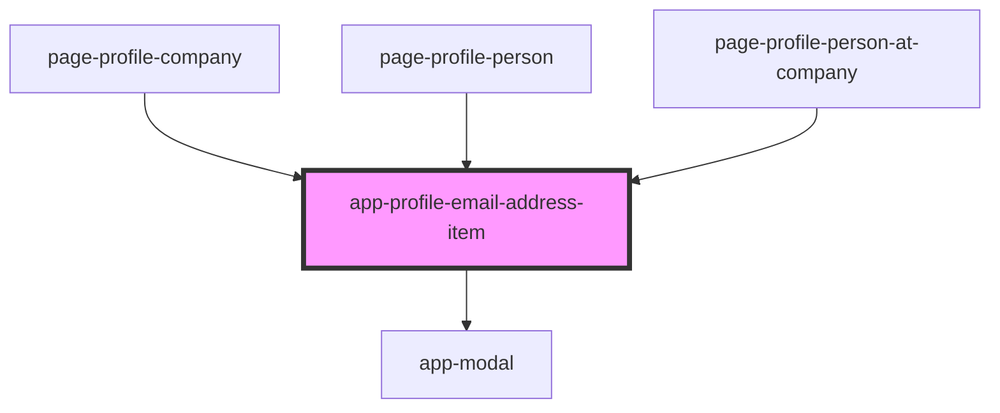

# app-profile-email-address-item

<!-- Auto Generated Below -->

## Properties

| Property                 | Attribute    | Description | Type                                                                 | Default     |
| ------------------------ | ------------ | ----------- | -------------------------------------------------------------------- | ----------- |
| `appliesTo` _(required)_ | `applies-to` |             | `AppliesTo.Company \| AppliesTo.Person \| AppliesTo.PersonAtCompany` | `undefined` |
| `emailAddressItem`       | --           |             | `DataResponse<EmailAddressAttributes>`                               | `undefined` |

## Dependencies

### Used by

 - [page-profile-company](../pages/page-profile-company)
 - [page-profile-person](../pages/page-profile-person)
 - [page-profile-person-at-company](../pages/page-profile-person-at-company)

### Depends on

- [app-modal](../app-modal)

### Graph

----------------------------------------------

*Built with [StencilJS](https://stenciljs.com/)*
