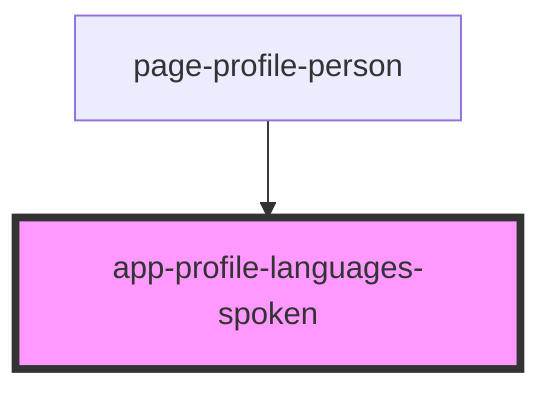

# app-profile-languages-spoken

<!-- Auto Generated Below -->

## Properties

| Property          | Attribute   | Description | Type                                 | Default     |
| ----------------- | ----------- | ----------- | ------------------------------------ | ----------- |
| `canEdit`         | `can-edit`  |             | `boolean`                            | `undefined` |
| `languagesSpoken` | --          |             | `DataResponse<LanguageAttributes>[]` | `undefined` |
| `personId`        | `person-id` |             | `number`                             | `undefined` |

## Dependencies

### Used by

 - [page-profile-person](../pages/page-profile-person)

### Graph

----------------------------------------------

*Built with [StencilJS](https://stenciljs.com/)*
