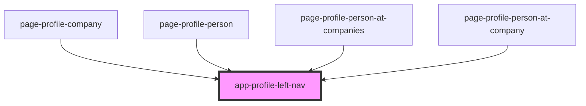

# app-profile-left-nav

<!-- Auto Generated Below -->

## Properties

| Property                 | Attribute          | Description | Type                                         | Default     |
| ------------------------ | ------------------ | ----------- | -------------------------------------------- | ----------- |
| `appliesTo` _(required)_ | `applies-to`       |             | `"company" \| "person" \| "personAtCompany"` | `undefined` |
| `me` _(required)_        | --                 |             | `GetRequestingPersonResponse`                | `undefined` |
| `selectedItemId`         | `selected-item-id` |             | `string`                                     | `undefined` |

## Dependencies

### Used by

 - [page-profile-company](../pages/page-profile-company)
 - [page-profile-person](../pages/page-profile-person)
 - [page-profile-person-at-companies](../pages/page-profile-person-at-companies)
 - [page-profile-person-at-company](../pages/page-profile-person-at-company)

### Graph

----------------------------------------------

*Built with [StencilJS](https://stenciljs.com/)*
