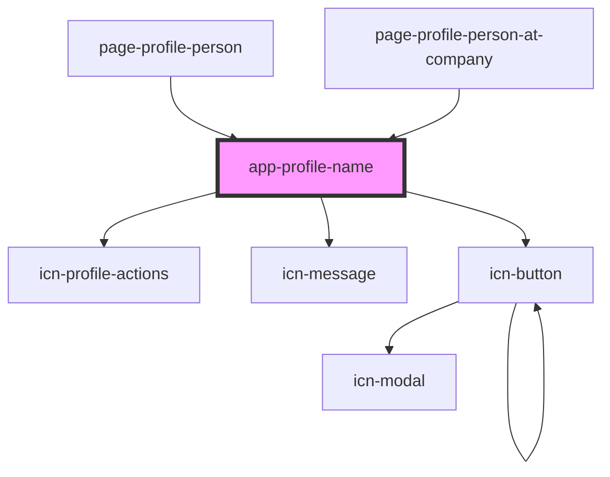

# app-profile-name-item

<!-- Auto Generated Below -->

## Properties

| Property     | Attribute  | Description | Type                       | Default     |
| ------------ | ---------- | ----------- | -------------------------- | ----------- |
| `canEdit`    | `can-edit` |             | `boolean`                  | `undefined` |
| `personItem` | --         |             | `DataResponse<PersonInfo>` | `undefined` |

## Dependencies

### Used by

 - [page-profile-person](../pages/page-profile-person)
 - [page-profile-person-at-company](../pages/page-profile-person-at-company)

### Depends on

- [icn-profile-actions](../icn-profile-actions)
- [icn-message](../icn-message)
- [icn-button](../icn-button)

### Graph

----------------------------------------------

*Built with [StencilJS](https://stenciljs.com/)*
