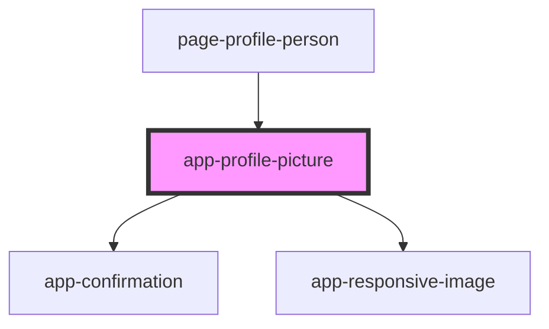

# app-profile-picture

<!-- Auto Generated Below -->

## Properties

| Property     | Attribute | Description | Type                       | Default     |
| ------------ | --------- | ----------- | -------------------------- | ----------- |
| `personItem` | --        |             | `DataResponse<PersonInfo>` | `undefined` |

## Dependencies

### Used by

 - [page-profile-person](../pages/page-profile-person)

### Depends on

- [app-confirmation](../app-confirmation)
- [app-responsive-image](../app-responsive-image)

### Graph

----------------------------------------------

*Built with [StencilJS](https://stenciljs.com/)*
