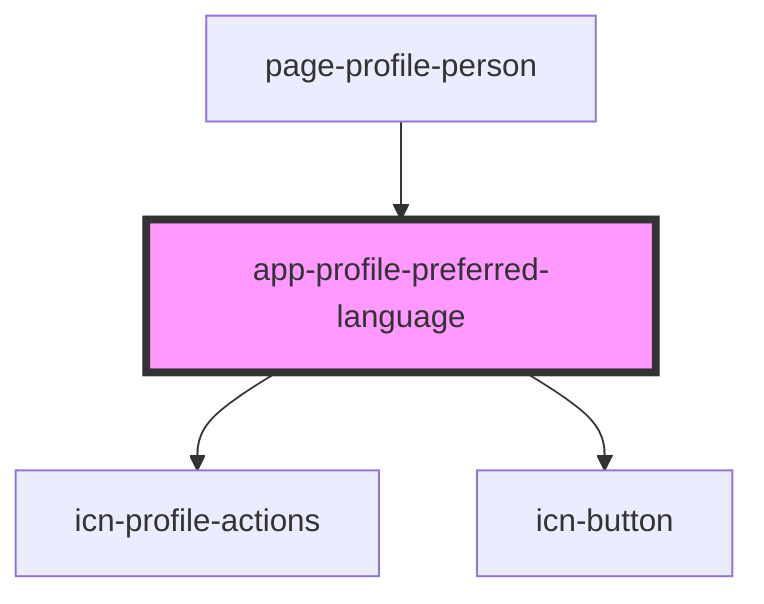

# app-profile-preferred-language-item

<!-- Auto Generated Below -->

## Properties

| Property       | Attribute   | Description | Type                               | Default     |
| -------------- | ----------- | ----------- | ---------------------------------- | ----------- |
| `canEdit`      | `can-edit`  |             | `boolean`                          | `undefined` |
| `languageItem` | --          |             | `DataResponse<LanguageAttributes>` | `undefined` |
| `personId`     | `person-id` |             | `number`                           | `undefined` |

## Dependencies

### Used by

 - [page-profile-person](../pages/page-profile-person)

### Depends on

- [icn-profile-actions](../icn-profile-actions)
- [icn-button](../icn-button)

### Graph

----------------------------------------------

*Built with [StencilJS](https://stenciljs.com/)*
