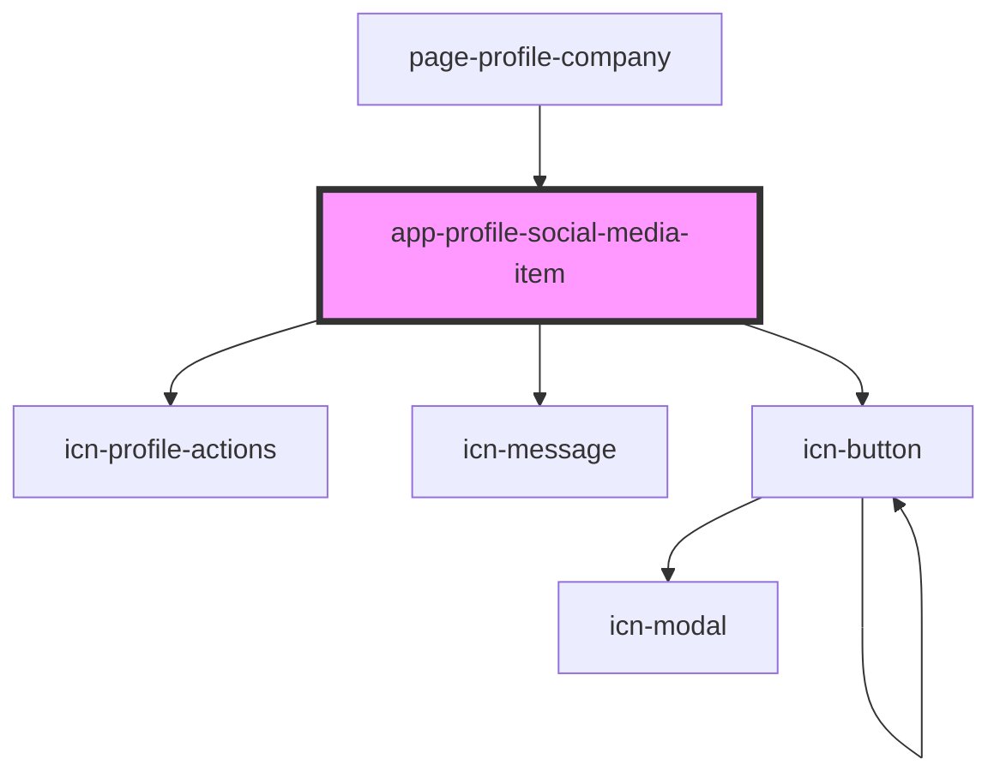

# app-profile-social-media-item

<!-- Auto Generated Below -->

## Properties

| Property          | Attribute    | Description | Type                                  | Default     |
| ----------------- | ------------ | ----------- | ------------------------------------- | ----------- |
| `canEdit`         | `can-edit`   |             | `boolean`                             | `undefined` |
| `companyId`       | `company-id` |             | `number`                              | `undefined` |
| `socialMediaItem` | --           |             | `DataResponse<SocialMediaAttributes>` | `undefined` |

## Events

| Event                | Description | Type                  |
| -------------------- | ----------- | --------------------- |
| `socialMediaDeleted` |             | `CustomEvent<number>` |

## Dependencies

### Used by

 - [page-profile-company](../pages/page-profile-company)

### Depends on

- [icn-profile-actions](../icn-profile-actions)
- [icn-message](../icn-message)
- [icn-button](../icn-button)

### Graph

----------------------------------------------

*Built with [StencilJS](https://stenciljs.com/)*
