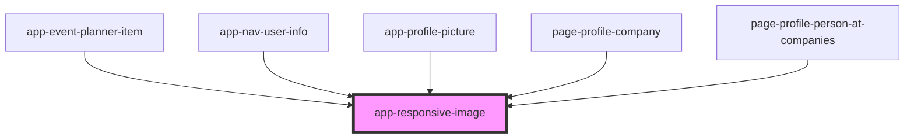

# app-responsive-image

<!-- Auto Generated Below -->

## Properties

| Property             | Attribute           | Description                                                               | Type        | Default          |
| -------------------- | ------------------- | ------------------------------------------------------------------------- | ----------- | ---------------- |
| `class`              | `class`             | The css class to pass down to the rendered image.                         | `string`    | `undefined`      |
| `expectedWidth`      | `expected-width`    | If specified, will get only the smallest image that satisfies this width. | `number`    | `undefined`      |
| `image` _(required)_ | --                  | The ImageInfo for this responsive image.                                  | `ImageInfo` | `undefined`      |
| `noImageDataUrl`     | `no-image-data-url` | The url to use if the image does not exist.                               | `string`    | `noImageDataUrl` |

## Dependencies

### Used by

 - [app-event-planner-item](../app-event-planner-item)
 - [app-nav-user-info](../app-nav-user-info)
 - [app-profile-picture](../app-profile-picture)
 - [page-profile-company](../pages/page-profile-company)
 - [page-profile-person-at-companies](../pages/page-profile-person-at-companies)

### Graph

----------------------------------------------

*Built with [StencilJS](https://stenciljs.com/)*
