# icn-button

<!-- Auto Generated Below -->

## Properties

| Property   | Attribute  | Description                                       | Type                                                                                                  | Default     |
| ---------- | ---------- | ------------------------------------------------- | ----------------------------------------------------------------------------------------------------- | ----------- |
| `disabled` | `disabled` | Defines if the button should be disabled          | `boolean`                                                                                             | `false`     |
| `reversed` | `reversed` | Defines if the button should be reversed (colors) | `boolean`                                                                                             | `false`     |
| `type`     | `type`     | Defines the overall style of the button.          | `"danger" \| "link" \| "neutral" \| "primary" \| "secondary" \| "success" \| "tertiary" \| "warning"` | `"primary"` |

## CSS Custom Properties

| Name                        | Description                                              |
| --------------------------- | -------------------------------------------------------- |
| `--color-background`        | The color for the background of the button.              |
| `--color-background-active` | The color for the background of the button when active.  |
| `--color-background-hover`  | The color for the background of the button when hovered. |
| `--color-border`            | The color for the border of the button.                  |
| `--color-foreground`        | The color for the foreground of the button.              |
| `--color-link`              | The color of the text for when used as a link-button.    |

## Dependencies

### Used by

 - [app-confirmation](../app-confirmation)
 - [app-profile-address-item](../app-profile-address-item)
 - [app-profile-biography](../app-profile-biography)
 - [app-profile-company-description](../app-profile-company-description)
 - [app-profile-company-logo](../app-profile-company-logo)
 - [app-profile-company-tagline](../app-profile-company-tagline)
 - [app-profile-company-website](../app-profile-company-website)
 - [app-profile-email-address-item](../app-profile-email-address-item)
 - [app-profile-job-title](../app-profile-job-title)
 - [app-profile-languages-spoken](../app-profile-languages-spoken)
 - [app-profile-name](../app-profile-name)
 - [app-profile-phone-number-item](../app-profile-phone-number-item)
 - [app-profile-picture](../app-profile-picture)
 - [app-profile-preferred-language](../app-profile-preferred-language)
 - [app-profile-social-media-item](../app-profile-social-media-item)
 - [page-profile-person-at-companies](../pages/page-profile-person-at-companies)
 - [page-ux-test](../pages/page-ux-test)

### Graph

```mermaid
graph TD;
  app-confirmation --> icn-button
  app-profile-address-item --> icn-button
  app-profile-biography --> icn-button
  app-profile-company-description --> icn-button
  app-profile-company-logo --> icn-button
  app-profile-company-tagline --> icn-button
  app-profile-company-website --> icn-button
  app-profile-email-address-item --> icn-button
  app-profile-job-title --> icn-button
  app-profile-languages-spoken --> icn-button
  app-profile-name --> icn-button
  app-profile-phone-number-item --> icn-button
  app-profile-picture --> icn-button
  app-profile-preferred-language --> icn-button
  app-profile-social-media-item --> icn-button
  page-profile-person-at-companies --> icn-button
  page-ux-test --> icn-button
  style icn-button fill:#f9f,stroke:#333,stroke-width:4px
```

----------------------------------------------

*Built with [StencilJS](https://stenciljs.com/)*
