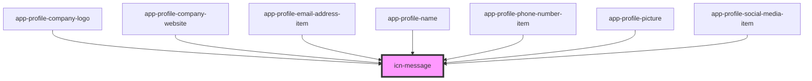

# icn-message

<!-- Auto Generated Below -->

## Properties

| Property            | Attribute     | Description | Type                                          | Default     |
| ------------------- | ------------- | ----------- | --------------------------------------------- | ----------- |
| `dismissible`       | `dismissible` |             | `boolean`                                     | `false`     |
| `hidden`            | `hidden`      |             | `boolean`                                     | `false`     |
| `type` _(required)_ | `type`        |             | `"error" \| "info" \| "success" \| "warning"` | `undefined` |

## Methods

### `hide() => Promise<void>`

#### Returns

Type: `Promise<void>`

### `reset() => Promise<void>`

#### Returns

Type: `Promise<void>`

### `show() => Promise<void>`

#### Returns

Type: `Promise<void>`

## Dependencies

### Used by

 - [app-profile-company-logo](../app-profile-company-logo)
 - [app-profile-company-website](../app-profile-company-website)
 - [app-profile-email-address-item](../app-profile-email-address-item)
 - [app-profile-name](../app-profile-name)
 - [app-profile-phone-number-item](../app-profile-phone-number-item)
 - [app-profile-picture](../app-profile-picture)
 - [app-profile-social-media-item](../app-profile-social-media-item)

### Graph

----------------------------------------------

*Built with [StencilJS](https://stenciljs.com/)*
