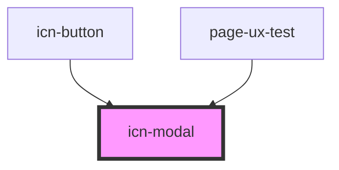

# icn-modal

<!-- Auto Generated Below -->

## Properties

| Property | Attribute | Description                              | Type                                                                                                  | Default     |
| -------- | --------- | ---------------------------------------- | ----------------------------------------------------------------------------------------------------- | ----------- |
| `type`   | `type`    | Defines the overall style of the button. | `"danger" \| "info" \| "neutral" \| "primary" \| "secondary" \| "success" \| "tertiary" \| "warning"` | `"primary"` |

## Methods

### `hide() => Promise<void>`

Hides the modal.

#### Returns

Type: `Promise<void>`

### `show() => Promise<void>`

Shows the modal.

#### Returns

Type: `Promise<void>`

## Dependencies

### Used by

 - [icn-button](../icn-button)
 - [page-ux-test](../pages/page-ux-test)

### Graph

----------------------------------------------

*Built with [StencilJS](https://stenciljs.com/)*
