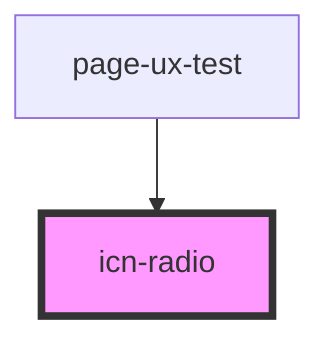

# icn-radio

<!-- Auto Generated Below -->

## Properties

| Property            | Attribute  | Description                                                                                       | Type      | Default     |
| ------------------- | ---------- | ------------------------------------------------------------------------------------------------- | --------- | ----------- |
| `checked`           | `checked`  | Defines if the radio button is selected or not.                                                   | `boolean` | `false`     |
| `disabled`          | `disabled` | Disables the radio button.                                                                        | `boolean` | `false`     |
| `name` _(required)_ | `name`     | Defines the name of the radio button (used to uncheck other radio buttons sharing the same name). | `string`  | `undefined` |
| `value`             | `value`    | Holds the value for this radio button.                                                            | `any`     | `undefined` |

## CSS Custom Properties

| Name                 | Description                                       |
| -------------------- | ------------------------------------------------- |
| `--color-background` | The color for the background of the radio button. |
| `--color-foreground` | The color for the foreground of the radio button. |

## Dependencies

### Used by

 - [page-ux-test](../pages/page-ux-test)

### Graph

----------------------------------------------

*Built with [StencilJS](https://stenciljs.com/)*
