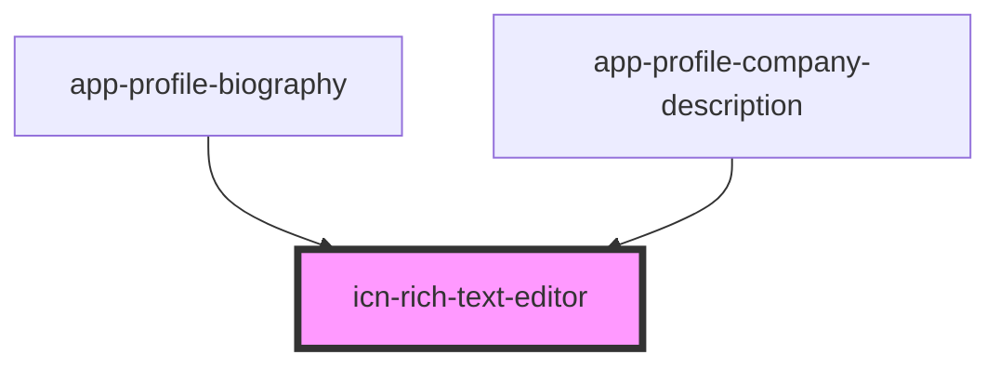

# icn-rich-text-editor

<!-- Auto Generated Below -->

## Properties

| Property  | Attribute | Description                                                                                       | Type     | Default                                                                                                                                                                                                                                                                                                                                                                                                                                                                                                                                                                                                                                                    |
| --------- | --------- | ------------------------------------------------------------------------------------------------- | -------- | ---------------------------------------------------------------------------------------------------------------------------------------------------------------------------------------------------------------------------------------------------------------------------------------------------------------------------------------------------------------------------------------------------------------------------------------------------------------------------------------------------------------------------------------------------------------------------------------------------------------------------------------------------------- |
| `options` | --        | Allows overriding the default config, see https://github.com/xdan/jodit/blob/master/src/config.ts | `Config` | `{     ...Jodit.defaultOptions,     buttons:[       "bold", "italic", "underline", "eraser", "ul", "ol", "superscript", "subscript", "cut", "copy", "paste", "copyformat", "link"     ],     buttonsMD: [       "bold", "italic", "underline", "eraser", "ul", "ol", "superscript", "subscript", "cut", "copy", "paste", "copyformat", "link"     ],     buttonsSM: [       "bold", "italic", "underline", "ul", "ol", "copy", "paste", "link", "dots"     ],     buttonsXS: [       "bold", "italic", "underline", "ul", "ol", "link", "dots"     ],     defaultActionOnPaste: "insert_as_text",     defaultActionOnPasteFromWord: "insert_as_text",   }` |
| `value`   | `value`   | The value of the html content                                                                     | `string` | `undefined`                                                                                                                                                                                                                                                                                                                                                                                                                                                                                                                                                                                                                                                |

## Methods

### `getValue() => Promise<string>`

Gets the current html value.

#### Returns

Type: `Promise<string>`

## Dependencies

### Used by

 - [app-profile-biography](../app-profile-biography)
 - [app-profile-company-description](../app-profile-company-description)

### Graph

----------------------------------------------

*Built with [StencilJS](https://stenciljs.com/)*
