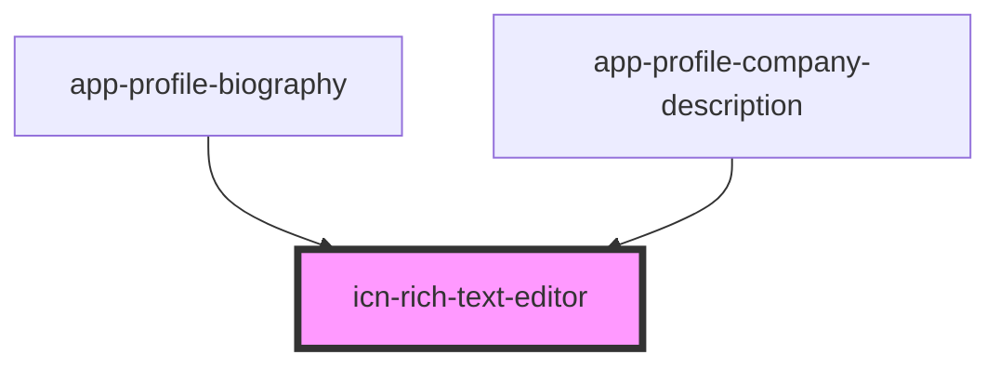

# icn-rich-text-editor

<!-- Auto Generated Below -->

## Properties

| Property | Attribute | Description                   | Type     | Default     |
| -------- | --------- | ----------------------------- | -------- | ----------- |
| `value`  | `value`   | The value of the html content | `string` | `undefined` |

## Methods

### `getValue() => Promise<string>`

Gets the current html value.

#### Returns

Type: `Promise<string>`

## Dependencies

### Used by

 - [app-profile-biography](../app-profile-biography)
 - [app-profile-company-description](../app-profile-company-description)

### Graph

----------------------------------------------

*Built with [StencilJS](https://stenciljs.com/)*
