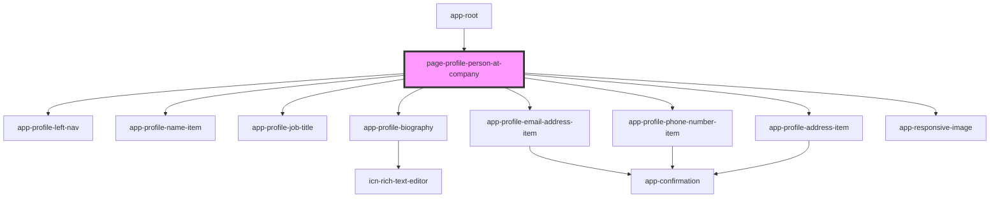

# page-profile-person-at-company

<!-- Auto Generated Below -->

## Properties

| Property            | Attribute              | Description | Type     | Default     |
| ------------------- | ---------------------- | ----------- | -------- | ----------- |
| `personAtCompanyId` | `person-at-company-id` |             | `string` | `undefined` |

## Dependencies

### Used by

 - [app-root](../../app-root)

### Depends on

- [app-profile-left-nav](../../app-profile-left-nav)
- [app-profile-name-item](../../app-profile-name-item)
- [app-profile-job-title](../../app-profile-job-title)
- [app-profile-biography](../../app-profile-biography)
- [app-profile-email-address-item](../../app-profile-email-address-item)
- [app-profile-phone-number-item](../../app-profile-phone-number-item)
- [app-profile-address-item](../../app-profile-address-item)
- [app-responsive-image](../../app-responsive-image)

### Graph

----------------------------------------------

*Built with [StencilJS](https://stenciljs.com/)*
