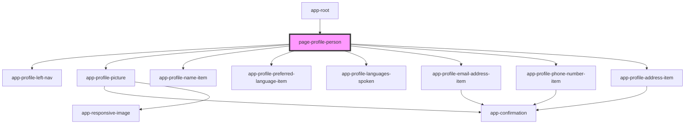

# page-profile-person

<!-- Auto Generated Below -->

## Dependencies

### Used by

 - [app-root](../../app-root)

### Depends on

- [app-profile-left-nav](../../app-profile-left-nav)
- [app-profile-picture](../../app-profile-picture)
- [app-profile-name-item](../../app-profile-name-item)
- [app-profile-preferred-language-item](../../app-profile-preferred-language-item)
- [app-profile-languages-spoken](../../app-profile-languages-spoken)
- [app-profile-email-address-item](../../app-profile-email-address-item)
- [app-profile-phone-number-item](../../app-profile-phone-number-item)
- [app-profile-address-item](../../app-profile-address-item)

### Graph

----------------------------------------------

*Built with [StencilJS](https://stenciljs.com/)*
